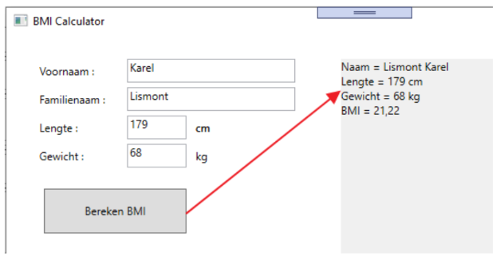

# Oefening methoden : BMI calculator  
  
Nadat je deze repository hebt ingeladen krijg je onderstaande GUI te zien : 
  
  
  
Je dient de 4 tekstvakken uit te lezen, aan de hand van lengte en gewicht de BMI waarde te berekenen en vervolgens een rapportje te genereren : 
  
  
  
  * Formule BMI : (gewicht in kg / (lengte in meter) * (lengte in meter)  
    Dus volgens bovenstaand voorbeeld : 64 / (1.79 * 1.79) of 68 / 1.79²  
      
  * Voor het berekenen van het BMI maak je een afzonderlijke methode aan die een double retourneert.  
    Deze methode verwacht als argumenten het gewicht in de vorm van een double en de lengte in cm in de form van een int.  
    *bv : double CalculateBMI(int LengthInCm, double weight)*  
