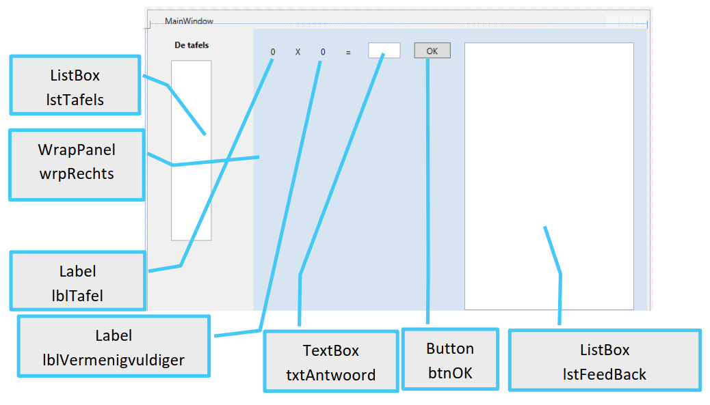
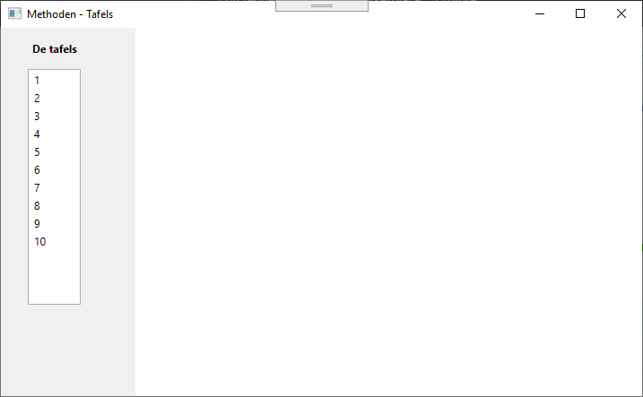
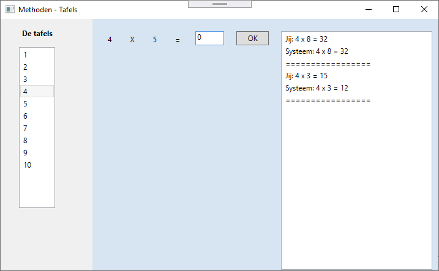

# Oefening methodes - Tafels
## Wat is de bedoeling?

Afhankelijk van de tafel die geselecteerd wordt geven we de gebruiker een oefening.

De gebruiker tracht de oefening op te lossen en vervolgens geven we feedback op zijn/haar antwoord.

## De controls waarmee we gaan werken:


## Startsituatie:
Wanneer het programma start:
- Vullen we lstTafels met de getallen 1 tot en met 10.
- Verbergen we wrpRechts (WrapPanel)



## Werking:
Van zodra een getal in lstTafels wordt aangeklikt wordt wrpRechts zichtbaar.
In lblTafel verschijnt de waarde die in lstTafels werd geselecteerd.
lstFeedback wordt leeggemaakt (gebruik hiervoor de methode ….Items.Clear() ).
In lblVermenigvuldiger verschijnt een random gekozen getal van 1 tot 10 (zie verder).
In txtAntwoord voert de gebruiker de oplossing van de vraag in.
Van zodra de gebruiker op btnOK klikt dienen er in lstFeedback (minstens) 3 lijnen ingevoegd te worden:

- Het antwoord van de gebruiker
- De oplossing van de vraag
- Een dubbele lijn

Vervolgens moet er onmiddellijk een nieuwe vraag aangemaakt worden op basis van de geselecteerde tafel
(uiteraard dient lstFeedback nu NIET leeggemaakt te worden).

Bijvoorbeeld:



> **Tip!**
>
> Om een item helemaal bovenaan een listbox toe te voegen (standaard gebeurt dit onderaan)
gebruik je niet de Add-methode, maar de Insert-methode.
>
> Bijvoorbeeld :
>
> ```lstFeedBack.Items.Insert(0, "dit komt helemaal bovenaan");```
>
>De eerste parameter ( 0 ) verwijst hier naar de plaats waar moet ingevoegd worden (hier dus als
>eerste element, en dus helemaal bovenaan)

> **RANDOM**
>
> In elke programmeeromgeving is een randomgenerator aanwezig.
> In C# genereer je een random getal bijvoorbeeld als volgt:
>
>````Random deGenerator = new Random();
>int randomGetal = deGenerator.Next(0, 100);
>````
>
> In de variabele randomGetal komt nu een willekeurig geheel getal gaande van 0 tot en met 99
> (de tweede parameter is dus de bovengrens maar is niet inbegrepen).
> Voor onze tafels hebben we dus nodig … (1,11)
>
> **Opgepast:**
>
>Je maakt je random generator best maar 1 keer aan (bijvoorbeeld in het
> Window_Loaded event), anders riskeer je dat je random generator helemaal niet random is.
>
> Bijvoorbeeld :
>
> ```
>private void Window_Loaded(object sender, RoutedEventArgs e)
> {
>       rnd = new Random();
>       …
> }
> ```
>
> Wanneer je dan verder een random getal nodig hebt laat je waar nodig het getal genereren.
>
> Bijvoorbeeld:
>
> ```
> private void maakVraag()
> {
>   vermenigvuldiger = rnd.Next(1, 11);
>   …
> }
> ```
> Meer info : https://docs.microsoft.com/en-us/dotnet/api/system.random.-ctor?view=netframework-4.8

## Vereisten:
- Je werkt met 3 klasse variabelen (variabelen die overal binnen de klasse gekend zijn).
```
Random rnd; //dit de randomgenerator
int tafel; //hierin bewaar je de geselecteerde tafel
int vermenigvuldiger; // hierin bewaar je het gegenereerde getal
```
- Het maken van de vraag dien je in een eigen methode te programmeren. Geef deze methode de naam
“MaakVraag()”.
    - Genereer het getal
    - Vul lblTafel en lblVermenigvuldige
    - Stel txtAntwoord in op “0” en geeft deze textbox de focus.

## Bijkomend:
Wil je nog wat meer. Zorg er dan voor dat in lstFeedback ook een melding komt of het antwoord al dan niet
correct was. Gebruik hiervoor `if{} else{}`.

# Veel succes en plezier!